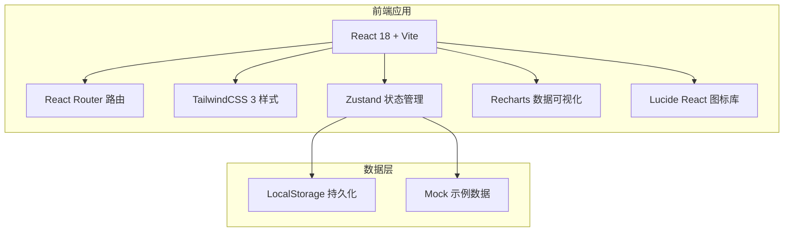
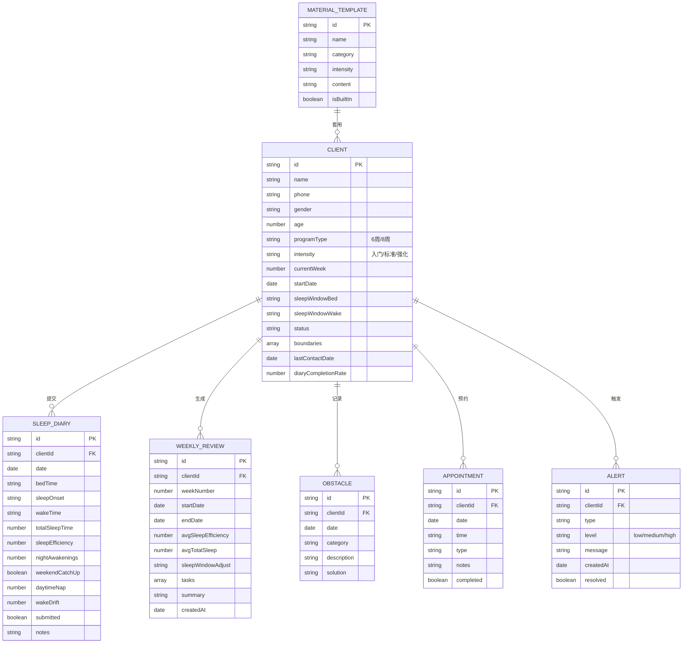

## 1. 架构设计

## 2. 技术描述
- **前端**：React 18 + TypeScript + Vite
- **样式方案**：TailwindCSS 3
- **状态管理**：Zustand（轻量级状态管理）
- **路由**：React Router v6
- **图表可视化**：Recharts
- **图标**：Lucide React
- **数据持久化**：LocalStorage（桌面端单用户场景）
- **初始化工具**：npm create vite@latest
- **后端**：无（纯前端桌面应用，所有数据本地存储）
- **数据库**：无（使用LocalStorage模拟持久化）

## 3. 路由定义
| 路由 | 用途 |
|------|------|
| / | 重定向至个案列表 |
| /clients | 个案列表模块 |
| /clients/:id | 个案详情页 |
| /schedule | 排程面板模块 |
| /diary | 日记审阅模块 |
| /materials | 训练素材模块 |
| /review | 周回顾模块 |
| /alerts | 提醒中心模块 |

## 4. 数据模型

### 4.1 数据模型定义

### 4.2 Mock数据结构
- 内置10-15位来访者模拟数据
- 每人随机生成4-8周睡眠日记
- 预置3套流程模板（入门/标准/强化）
- 预置15+认知练习素材
- 模拟预警数据（失联、低执行率、夜班变动）
